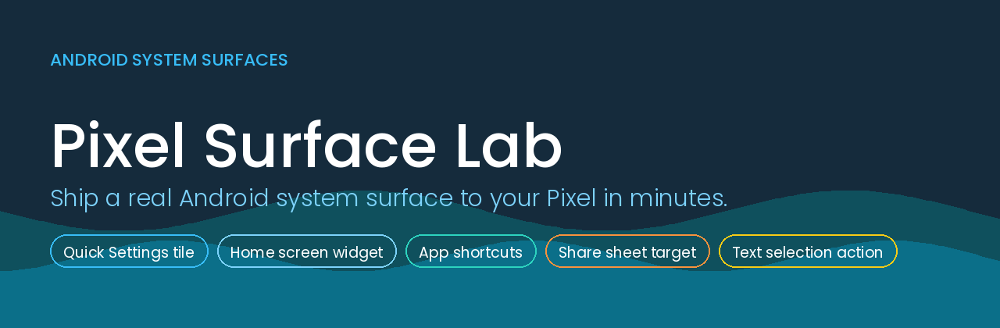
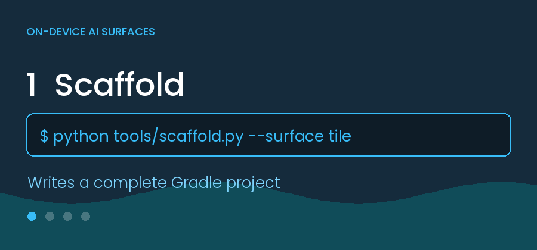
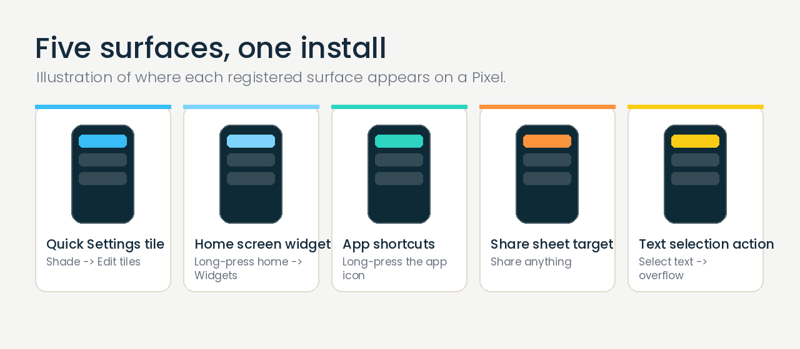

<p align="center">
  
</p>

<p align="center">
  <a href="https://github.com/OWNER/REPO/actions/workflows/build.yml">
    
  </a>
  <a href="https://github.com/OWNER/REPO/releases/latest">
    
  </a>
  
  
  
</p>

---

## What this is

A template for putting a **real Android system surface** onto your own Pixel
without installing Android Studio, configuring an SDK, or fighting an emulator.

Run one script, push, tap a link on the phone. Roughly five minutes end to end,
most of it waiting for CI.

The repo you are looking at is itself a working example: it registers all five
surfaces at once. Push it and you get an installable APK.

<p align="center">
  
</p>

---

## The five surfaces

<p align="center">
  
</p>

| Surface | `--surface` key | Where it appears | API |
|---|---|---|---|
| Quick Settings tile | `tile` | Shade → Edit tiles → *From apps that you installed* | 24+ |
| Home screen widget | `widget` | Long-press home → Widgets | 26+ |
| App shortcuts | `shortcuts` | Long-press the app icon | 25+ |
| Share sheet target | `share` | Share anything → app row | all |
| Text selection action | `processtext` | Select text → popup overflow | 23+ |

Combine them freely: `--surface tile,widget` or `--surface all`. They are
independent manifest registrations, so combining costs nothing.

Not generated but documented in [`docs/surfaces.md`](docs/surfaces.md):
notification listener, live wallpaper, accessibility service, direct share,
deep links — plus the surfaces that **aren't** extensible (Now Playing, At a
Glance, Quick Share), which saves you going looking.

---

## Quickstart

### Use this repo as-is

```bash
git clone https://github.com/OWNER/REPO.git my-surface-app
cd my-surface-app
./ship.sh          # creates your own repo and pushes
```

### Or generate a fresh, smaller app

```bash
python tools/scaffold.py \
  --out ../my-tile \
  --package com.example.mytile \
  --app-name "My Tile" \
  --surface tile

python tools/verify.py ../my-tile
```

Then push. The **Build debug APK** workflow runs on every push and publishes the
APK to a rolling `debug-latest` release, so **the download URL never changes** —
bookmark `/releases/latest` on your phone once and re-use it forever.

### Get it on the phone

1. Open the repo's **Releases** page on the Pixel.
2. Tap `*-debug.apk`.
3. Allow installs from Chrome when prompted.
4. Find the surface using the table above. For the tile, just open the app and
   press **Add tile to Quick Settings** — on Android 13+ that pops the system
   dialog and skips the drag-and-drop entirely.

> **Why the release and not the artifact?** GitHub always serves workflow
> artifacts as a `.zip`, and Android will not install a zip. A release asset is
> a direct `.apk` URL. This is the single most common place this workflow dies.

---

## Verify before you push

```bash
python tools/verify.py .
```

A CI round trip costs about three minutes. This takes two seconds, needs no
Android SDK, and catches the failures that would otherwise burn that trip:

- dangling `@drawable/…` / `R.string.…` references
- manifest components with no matching Kotlin source
- an `intent-filter` with no `android:exported` (a hard AGP error)
- malformed XML, missing launcher activity
- imports that need a dependency this project deliberately doesn't declare
- a workflow missing `contents: write` (releases fail with a silent 403)

Exit code is non-zero on failure, so it chains: `python tools/verify.py . && git push`

---

## Repo layout

```
├── app/                  Android module — the working example
│   └── src/main/
│       ├── java/…        TileService, AppWidgetProvider, activities
│       ├── res/          icons, widget layout, shortcuts
│       └── AndroidManifest.xml
├── tools/
│   ├── scaffold.py       generates a new surface app
│   ├── verify.py         static pre-flight checks
│   └── make_assets.py    regenerates the branded images
├── docs/
│   ├── surfaces.md       every surface, its gotchas and constraints
│   ├── versions.md       toolchain matrix + error→fix mapping
│   └── delivery.md       signing, install prompts, private repos
├── assets/               banner, social card, diagram, GIF, fonts
└── .github/workflows/    the build
```

---

## Design decisions

**Zero dependencies.** Everything uses framework APIs only. No AndroidX, no
Compose, no Material. Dependency resolution is the most common source of
mystery build failures, and this removes it entirely. `verify.py` enforces the
invariant, so a stray `import androidx.…` fails locally rather than in CI.

**No Gradle wrapper.** The workflow installs Gradle directly via
`gradle/actions/setup-gradle`, which avoids committing a binary `gradle-wrapper.jar`.
Android Studio will offer to add a wrapper if you open the project locally.

**Debug signing.** Correct for a personal test, wrong for distribution. Note
that an APK signed with a different key cannot upgrade over an existing
install — switching between a local build and a CI build hits
`INSTALL_FAILED_UPDATE_INCOMPATIBLE`, and the fix is to uninstall first. See
[`docs/delivery.md`](docs/delivery.md) for real signing.

**Generated assets.** Images are produced by `tools/make_assets.py` from brand
tokens rather than checked in as opaque blobs, so the whole set can be re-themed
by changing a few constants.

---

## Re-theming

Edit the theme tokens at the top of `tools/make_assets.py`. To add a logo, drop
a transparent `wordmark.png` into `assets/` — without one the assets fall back to
a typographic eyebrow label. Then re-run:

```bash
python tools/make_assets.py
```

Every image regenerates consistently. The app's own colours live in
`app/src/main/res/values/colors.xml` and the launcher icon in
`res/drawable/ic_launcher_foreground.xml`.

---

## When the build fails

Nearly always toolchain version skew, not broken code — Gradle, AGP, the Kotlin
plugin, the JDK and `compileSdk` all constrain each other.
[`docs/versions.md`](docs/versions.md) maps the exact error strings to the thing
to bump. Read the Actions log first; the build runs with `--stacktrace`.

---

## Scope

These are prototypes for your own device. Play Store distribution, background
execution, or anything reading other apps' content (notification listeners,
accessibility services) is a different problem with policy constraints —
`docs/surfaces.md` flags which surfaces carry them.

---

<p align="center">
  <sub>MIT licensed · Illustrations in this README are diagrams, not device screenshots</sub>
</p>
