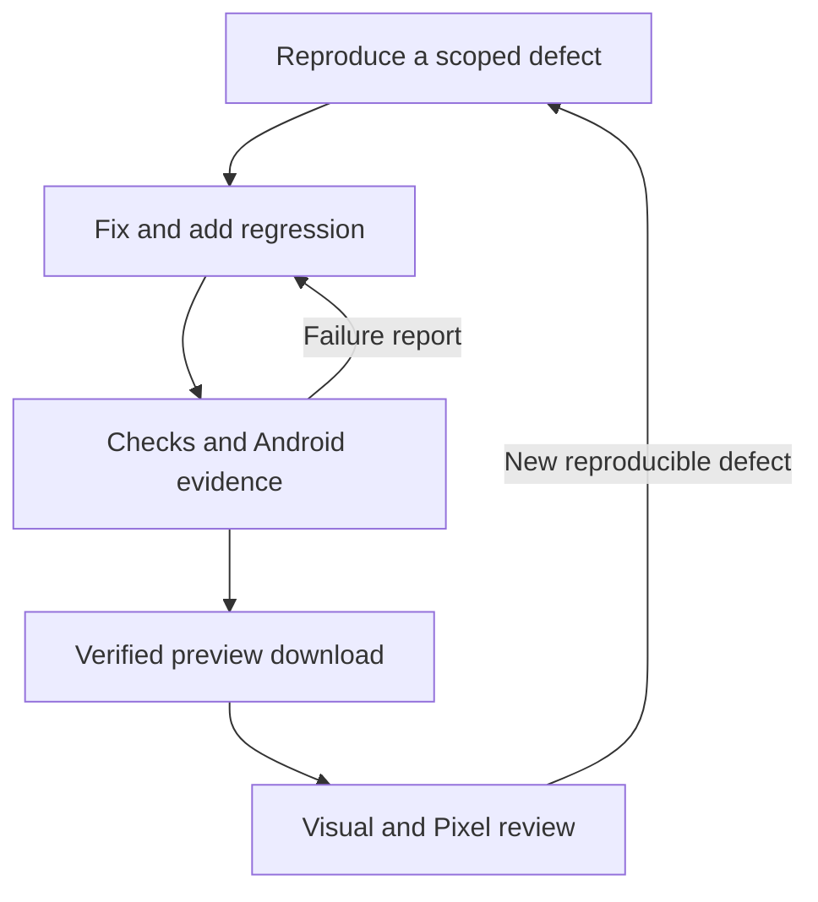

# Iteration workflow and audit

September 14, 2026 · Ægentica AI · Applies to `improve-pixel-assistant`.

## Goal and boundary

Every iteration should leave a reproducible chain from source → checks → APK → published download, with enough evidence to diagnose a regression without repeating the whole investigation. CI now closes that mechanical loop. Product judgment, visual review, real Gemini Nano/speech behavior and physical Pixel acceptance remain explicit agent/owner work. This is not an unattended agent that edits its own code indefinitely or a claim of production certification.

## Workflow audit

| Previous friction | Implemented improvement | Evidence / limit |
|---|---|---|
| Three Android installations and Gradle configurations per run | One Android quality job and one Gradle invocation for tests, lint and both variants | Setup/configuration duplication removed; wall time still depends on cold caches and runner load |
| Build caches read-only on this development branch | Trusted push runs may populate Gradle caches; PR runs read only | Signing keys remain outside the cache in runner temporary storage |
| Test reports uploaded only on failure | JUnit XML, lint reports and native screenshots retained on every run | Failed runs keep diagnostic artifacts for 14 days |
| Test counts inferred from source or console logs | Parse actual JUnit XML; reject missing, empty, failed or skipped results | `release-evidence.json` records counts |
| No Android lint release gate | Run core and Nano lint; errors/fatals block | Warnings remain visible in reports; zero-error is not zero-debt |
| Manual APK renaming and binary-manifest inspection | Validate both application IDs, build number and version names in the evidence tool | Wrong variant/version blocks packaging |
| Screenshot files detached from source/run | Bundle provenance, dimensions, hashes and an HTML contact sheet | Native core fixtures; PNG checks do not replace visual judgment |
| Re-uploading every screenshot into git each iteration | Generated evidence bundle carries all current native renders | README retains curated illustrations; release bundle is current evidence |
| Deleting the rolling release before recreating it | Publish and verify a unique build release first, then update compatibility assets | Rolling aliases are still multiple operations, not an atomic transaction |
| Only a mutable download URL | Build-specific APK link retained for handoff and rollback | A rerun gets an attempt suffix; Android version code can remain the same |
| Manual checksum comparison after release | CI downloads uploaded assets and checks their SHA-256 | Artifact integrity does not certify model behavior |
| Repository-wide write token during compilation | Read-only default; only publication has `contents: write` | Private signing excluded from PR jobs; checkout credentials not persisted |
| Floating action tags / deprecated runners | Reviewed official action versions pinned to commit SHAs | Update deliberately; do not silently follow every new release |
| Long repeated explanations without a defect contract | One preflight command, regression tests, current docs and structured issue/PR templates | The outer agent still prioritizes and fixes defects |

## Repeatable loop

1. **Establish the source.** Read branch HEAD and local status; preserve unrelated edits. Use the existing feature branch and draft PR. Capture a fresh baseline when evaluating the actual product flow. A PR-only test rerun can capture without republishing old APKs.
2. **Define the failure.** Record the affected flow, expected/actual behavior and a concrete acceptance check. Separate visual evidence from lifecycle behavior, which needs a test or device reproduction.
3. **Implement one coherent batch.** Reuse `Design.kt`, shared navigation pause behavior, native controls and data contracts. Add focused regression tests for meaningful failure modes. Do not add features solely because an Android API exists.
4. **Run `python tools/check.py`.** This runs resource/source checks, checker regressions, documentation links and release-evidence tests. Fix the first concrete failure, then rerun. Android validation runs in the pinned SDK environment.
5. **Inspect CI evidence.** The Android quality job runs tests, lint and both builds together. Download **aegentica-evidence**, run `python tools/release_evidence.py verify <directory>`, and open `review.html`. Inspect affected states and their light/dark/size variants. Failing runs expose **android-diagnostics**; rerun infrastructure failures once after identifying them, rather than hiding flaky behavior with blind retries.
6. **Verify the handoff.** Push runs publish a unique release only after mechanical gates pass. CI compares downloaded release bytes before updating compatibility URLs. Read the job summary for the new APK link and match the installed build in Settings. Use the unique link in user handoffs.
7. **Close the feedback loop.** Record visual acceptance and material limitations in the PR. On Pixel, run the relevant checks in [testing](testing.md). Turn a device failure into a redacted issue and regression where practical, not an unbounded rewrite.

CI publication is a personal preview gate, not a visual approval gate: a reviewer can still reject a mechanically passing build. Never call screenshots reviewed merely because `review.html` exists. Machine evidence explicitly says `visual_review: required` and `device_validation: required`; review status belongs in the PR/device record.

## Evidence contract

The bundle contains both branded APKs and compatibility aliases, actual JUnit/lint XML, native screenshots, `review.html`, `release-evidence.json`, and `SHA256SUMS`. The manifest records source SHA, CI run, build, attempt, test totals, lint severities, APK identities, screenshot dimensions and file hashes. It excludes private signing material and real user conversations.

The package tool rejects incomplete evidence and stale non-empty destinations. Publication checks the source/run/repository and skips a branch that has advanced. Build releases use `preview-<branch>-build-<number>`; repeated attempts append `-r<attempt>`. Already published build assets are never silently replaced. A partially uploaded draft can be retried. The unique release is published before the rolling alias changes, so a failed alias refresh does not destroy the verified build download.

`workflow_dispatch` validates and captures without publishing. PR runs validate the merge checkout with no private key and never publish. Push runs validate branch HEAD and publish. Both events are retained intentionally: they check different commits; eliminating PR checks would lose merge-result coverage. Preflight uses hosted Python; Android versions remain pinned in [versions](versions.md).

## Next improvements

- **P0: signing continuity.** Provision an owner-controlled private key using [delivery](delivery.md#signing). CI cannot recover an old debug key or promise data-preserving updates without it.
- **P0: Pixel device record.** Record Android/AICore, language, output device, installed build and precise failed step. No private transcript upload is necessary.
- **P1: measured performance.** Add a dedicated benchmark target and repeatable startup/frame/memory/battery budgets on physical hardware. Pipeline consolidation is not proof of app runtime speed.
- **P1: visual comparisons.** Stabilize fixtures, fonts, clock and animation state before adding approved image-diff thresholds. Do not auto-approve images merely to make a gate green.
- **P1: protected promotion.** When moving beyond personal previews, separate candidate creation from Play/internal-track promotion, require release signing and device acceptance, and configure repository protection through authorized administration access.
- **P2: bounded agent orchestration.** A future issue-triggered agent should have scoped branches, attempt/time budgets, read-only diagnostics, explicit stop conditions and no access to signing keys. Current CI does not claim that orchestration exists.

## Sources

Least-privilege tokens follow [GitHub's authentication guidance](https://docs.github.com/en/actions/tutorials/authenticate-with-github_token). Pinned action versions were checked against the official [checkout](https://github.com/actions/checkout/releases), [setup-java](https://github.com/actions/setup-java/releases), [upload-artifact](https://github.com/actions/upload-artifact/releases), [download-artifact](https://github.com/actions/download-artifact/releases) and [Gradle actions](https://github.com/gradle/actions/releases) repositories. Native switches retain the [Android Switch API](https://developer.android.com/reference/android/widget/Switch) interaction model.
