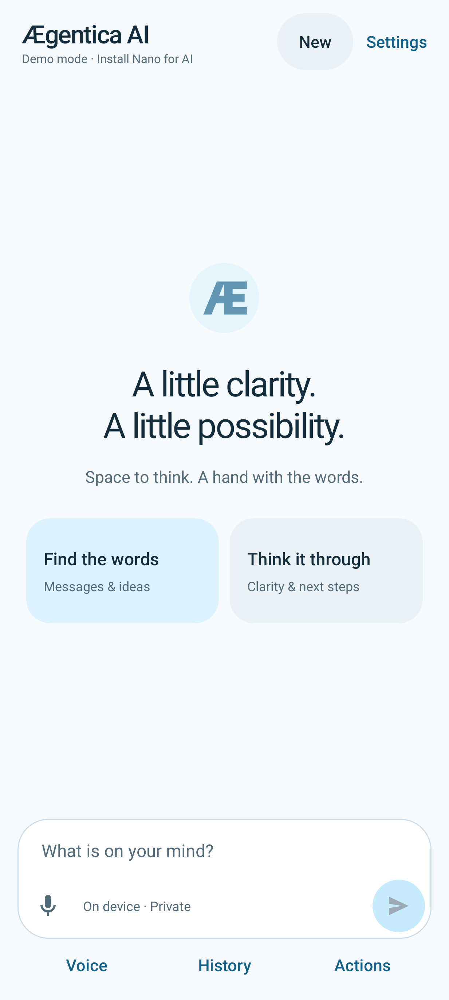
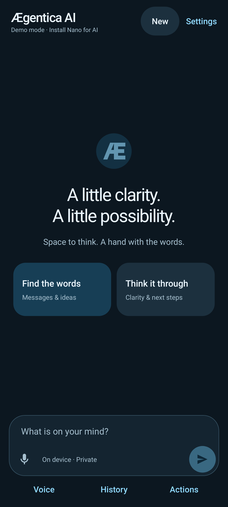
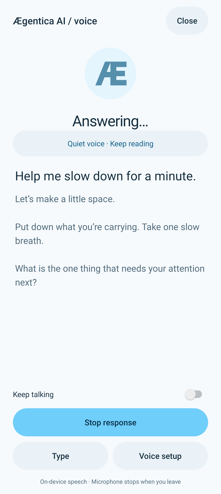
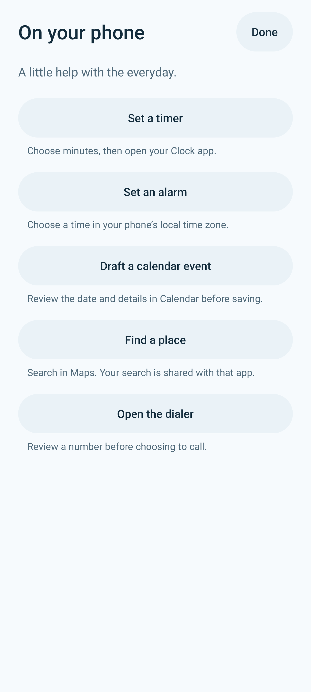
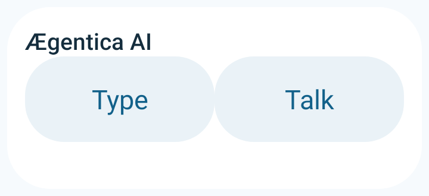
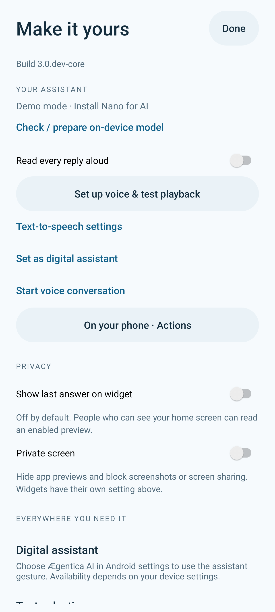
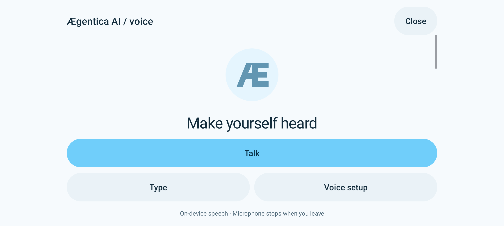

# Ægentica AI quality audit

September 14, 2026 · Native Android preview · Pixel 10 Pro XL target.

## Verdict

The app now has a coherent Æ identity and a broader native workflow: chat/voice, useful Android app handoffs, responsive access surfaces, keyboard commands and explicit privacy controls. This is an implemented and tested preview, not evidence that every Android API should be enabled or that device quality is certified. The largest remaining quality gates are stable signing, physical speech/model evaluation, accessibility traversal, performance measurements and controlled production distribution.

The [Android capability plan](android-native-plan.md) inventories more than 40 areas, the six-phase implementation sequence, acceptance tests, and conditional/future work. [Native actions](native-actions.md) explains exact side effects; [design tokens](design-system.md) explains the branding and contrast choices.

## Evidence

The baseline was freshly captured in this audit by rerunning the native JVM job for commit `ce46952613b68da19b6aabb9c8ea6f4bd2ad18c4`, [run 34877620946](https://github.com/Caceras/my-surface-app/actions/runs/34877620946), screenshot artifact **10364295005**, generated at **18:47 UTC**. Compact chat and voice setup were inspected before accepting baseline findings. The previous conversation's cached images were not used as evidence for this pass.

Updated images below are actual framework/Skia renders of the core test variant. They use deterministic content, not real Nano output, a Pixel screen recording, or a measured frame-time trace. The final source/run and APK verification are recorded in the preview PR. The reviewed screenshots come from commit `5f84ef075eeff1146abed17b9005b503ef22cc6f`, [run 34884129693](https://github.com/Caceras/my-surface-app/actions/runs/34884129693), which passed **133 JVM tests** and both APK builds. Final packaging changes receive the same CI gates.

## Eight steps

| Step | Flow | Baseline gap | Result / health |
|---|---|---|---|
| 1 | Launch and recognize the app | Green Surface identity; missing branded monochrome/splash treatment | Ægentica AI, custom Æ vectors and sky-blue semantic colors; launcher masks/splash remain a device check |
| 2 | Type and navigate | Compact header and wide-window behavior need stronger handling; limited keyboard discovery | Adaptive header/reading width, native keyboard help and commands, system back opt-in; device gesture/IME timing unmeasured |
| 3 | Speak, read and interrupt | Voice hero consumes fixed height; no media-button/unplug integration | Scrollable voice content, retained stop controls, foreground media transport and disconnect muting; real headset routing needs testing |
| 4 | Do an everyday phone task | No in-app route to Clock/Calendar/Maps/Dialer | Explicit validated Actions forms and Android handoffs; destination success is not inferred from launching an intent |
| 5 | Return through Android surfaces | Generic widget styling, default answer exposure, periodic polling, few shortcuts | Branded compact/full widget, previews opt-in, event-driven updates, History/Actions and pin requests; launcher behavior needs device check |
| 6 | Protect private content | No screenshot/Recents preference or sensitive clipboard marker | Private screen across app windows, widget privacy and clipboard metadata; not encryption or control over destination apps |
| 7 | Read at different sizes | Limited evidence for large type, landscape, desktop-sized windows | Dedicated native renders and measurable layout tests; TalkBack/Switch Access and real folding remain device gates |
| 8 | Install, maintain and understand | Surface branding and missing capability roadmap | Updated README, plan, design/actions/privacy/setup/architecture/test guides; verified direct Nano APK; persistent signing remains owner setup |

## Native screenshots

### 1–2 · Identity and chat

The sky accent is paired with dark text on primary controls and a darker blue for links on light backgrounds. The checked token pairs exceed 4.5:1; this is not a blanket accessibility conformance claim.

### 3 · Voice

Voice status and identity scroll with the transcript, so short windows have a usable text viewport. Stop/quiet behavior and stream cancellation are exercised independently from the still image.

### 4 · Native actions

Actions explain what goes to Clock, Calendar, Maps or the dialer. Forms validate input and preserve the chat draft. No generated model text is executed as an intent.

### 5 · Access

The compact widget never contains the answer. Default full widgets also omit it until the user enables previews. A launcher ultimately controls sizing, pin confirmation and themed-icon display.

### 6 · Privacy

Each control explains its scope before it is enabled. The screenshot uses test data with screen protection off.

### 7 · Window adaptation

The wide reading column is capped at 720 dp; the app still fills its window. Large-font and wide renders are also emitted by the screenshot test suite. A native still cannot prove smooth hardware resize or correct accessibility traversal.

## Reliability and privacy

- Kept earlier regression fixes for draft recovery, stale streaming callbacks, Unicode backup limits, voice setup re-entry, audio-focus interruption and searchable archives.
- Added user-selected Android handoffs with input bounds, URI encoding and missing-handler recovery. No broad contacts/location/calendar/call permission was added.
- Media Stop/Pause and headphone disconnect mute future streamed speech. The session does not expose answer text as media metadata and does not implement background playback.
- Widget update polling is removed; refresh follows app/launcher events. Widget receiver is non-exported; activity PendingIntents remain explicit and immutable.
- Screen protection is opt-in; answer previews are opt-in; clipboard carries sensitive metadata; IME personalized-learning suppression is requested. These controls have different scopes and are explained separately.
- Backup/transfer exclusions and package IDs preserve the intended local-data boundary and rebrand compatibility. Debug signing continuity is still a separate problem.

## Remaining quality work

| Priority | Work | Required evidence / dependency |
|---|---|---|
| P0 | Stable private signing and dependable upgrades | Owner-controlled private key and recovery process; never publish keys |
| P0 | Pixel acceptance run | Real Nano output, speech languages, interruption, shortcuts, widgets, back, external app actions and lifecycle |
| P1 | Accessibility qualification | TalkBack, Switch Access, text/display scaling, complete contrast/state review and keyboard traversal |
| P1 | Performance budgets | On-device startup, first-text/audio, frame timing, memory, battery and long-history profiles |
| P1 | Production release pathway | Release signing/AAB, Play internal testing, pre-launch report, privacy disclosures and support |
| P2 | Transactional history / richer AI | Storage migration and fixed prompt evals before large history, images or model-controlled actions |
| Conditional | Background, hotword, bubbles, companions, cloud/MCP | Separate product/lifecycle/privacy design and platform or account eligibility; not enabled by this preview |

## Verification

Source/resource and documentation checks, checker regressions, JVM activity/logic tests and both APK builds are required. New tests cover Actions handoff/input validation, keyboard and shortcut routing, widget privacy, screen/clipboard protection, media stop/disconnect, and adaptive native layouts. [Testing guide](testing.md) gives the full reproducible commands and physical Pixel checklist.

The final handoff must match the release commit and APK package/version/checksum. A passing core test suite does not establish Nano accuracy, real speech quality, 120 Hz performance, or accessibility certification.
