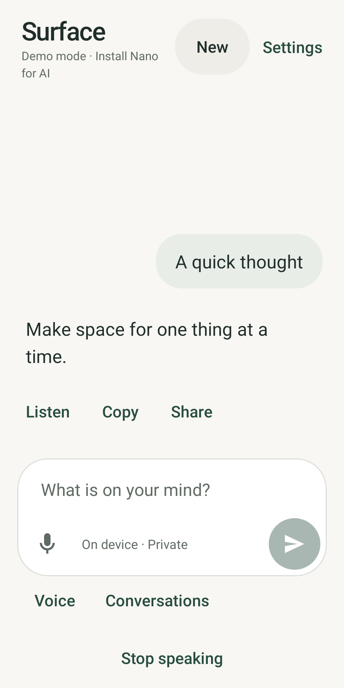
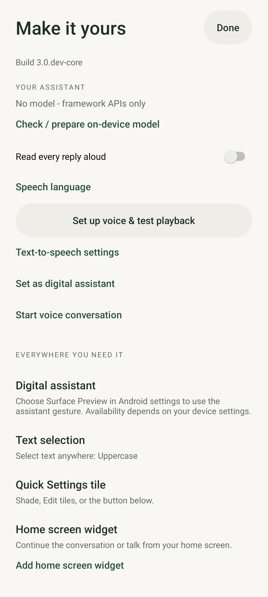
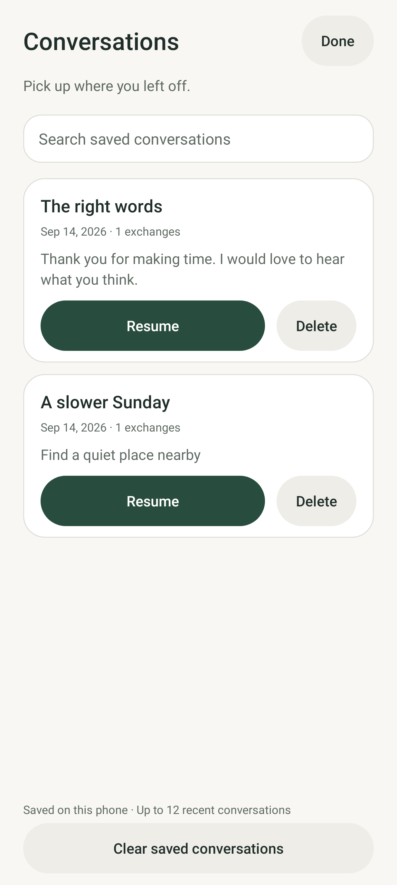

# Quality audit

**Scope:** Surface Preview on `improve-pixel-assistant`, September 14, 2026. This pass reviews the implemented Android flows, source, storage, documentation, and automated tests. It does not certify production readiness or accessibility compliance.

**Goal:** type or dictate, hear an answer, stop or resume without surprises, and understand installation/data behavior. Preserve the established warm visual system while improving interaction clarity and reliability.

## Evidence

The baseline was freshly rendered for this audit from commit `5280b31175f4ca8456ee0ebe527c46bc8871c766` by rerunning the JVM job in [run 34872298157](https://github.com/Caceras/my-surface-app/actions/runs/34872298157). The new baseline screenshots were generated at 17:31 UTC, not reused from the earlier conversation. Native Skia screenshots show framework/core layouts with deterministic data, not real Gemini Nano output or Pixel system UI.

The updated screenshots below were generated from `e148efaa8f339e64dedb68e25f2fc4bd97686af3` in [run 34876844848](https://github.com/Caceras/my-surface-app/actions/runs/34876844848) and visually reviewed. A later copy-only correction changes “1 exchanges” to “1 exchange”; the captured source remains explicit. The latest passing source run is linked from the preview PR/release. Findings about callbacks, exports, and model behavior come from source and tests, not from still images.

## Flow review

| Step | Task | Baseline finding | Result / remaining check |
|---|---|---|---|
| 1 | Open chat and type | Clear hierarchy, useful starters and persistent Voice entry; keyboard transition and compact playback layout need deeper checks | Composer follows IME transitions; playback gets its own full-width row; hardware animation timing still unmeasured |
| 2 | Read a streamed reply | Main chat already preserves reading position; all three text surfaces repeatedly reformat partial replies and voice/selection force the scroll position | First partial paints immediately; bursts are coalesced; final/stop clears queued paints; speech submission remains immediate; voice/selection preserve a reader’s position |
| 3 | Configure voice | Settings exposes overlapping language/setup routes | One guided setup route, including System language; opening setup on an existing Voice activity cannot start capture |
| 4 | Speak and interrupt | Quiet voice is visually styled like passive guidance; audio focus loss can leave stale playback state | Action styling while speaking; interruption reports why playback paused and keeps subsequent chunks muted |
| 5 | Resume a saved chat | The archive dialog exposes titles with little context and only bulk deletion | Search, date, preview, Resume, and individual confirmed Delete; current drafts survive switching |
| 6 | Export / restore | Import counted bytes but parsing/export used different size assumptions; export validation could throw outside error handling | Shared UTF-8 byte limit, pre-write validation, recoverable error; Unicode overflow regression coverage |
| 7 | Use selected text | Dictation replaced a prompt that was already typed | Dictation appends to the existing selection prompt; silence/error restores the original prompt |
| 8 | Install and understand limits | README mixes preview/prototype instructions and includes stale broad claims | Current preview download first; explicit core/Nano distinction, signing/data guidance, source-backed limits and focused guides |

## Visual evidence

### Chat

Steps 1–2. The established spacing, type hierarchy and starter cards remain. The composer and navigation are inspected again at 320 dp width with active playback. Smoothness claims are limited to implemented behavior and timing tests; no device frame-time benchmark has been run.

### Settings

Step 3, before. “Speech language” and the separate guided voice setup create competing paths. The duplicate language chooser is removed; the guided setup is now the single app-owned language route. Android's own TTS settings remain a recovery destination.

### Voice

Step 4. Quiet voice has an action treatment while speaking. Its disabled/idle states should not masquerade as active buttons. Voice setup re-entry, interruption, cancellation and microphone release are tested separately from this render.

### Conversations

Step 5. The new browser offers context before resuming and separate confirmed deletion. Search matches retained questions, replies and drafts. Retention remains bounded; this is recent history, not an unlimited archive.

## Reliability findings

| Priority | Finding | Handling |
|---|---|---|
| High | Existing Voice activity ignores a setup intent and can enter listening | Fixed with an explicit setup branch and regression test |
| High | A backup can pass a character limit but exceed the file reader's UTF-8 byte limit | Fixed with one shared byte limit and Unicode test |
| High | Audio-focus interruption leaves UI/session state out of sync with silent playback | Fixed through the existing failure/idle path; interruption test checks muting and completion |
| Medium | Multiple partial callbacks rebuild spans/layout repeatedly | Coalesced UI work; final/cancellation fencing tested |
| Medium | Selection dictation overwrites typed context | Existing draft retained and appended to; regression test |
| Medium | Archive navigation lacks search/context/individual deletion | New native conversation browser and interaction/screenshot coverage |
| Medium | Documentation conflates on-device inference with universal offline/network guarantees | Rewritten current behavior, privacy boundaries and platform references |

## Accessibility

The reviewed screens have readable light/dark palettes, labeled primary controls and 48 dp minimum control targets in the relevant flows. The current test suite checks several touch targets and layout/inset cases. The new archive actions name their target conversation for assistive technology. Motion honors Android's animator setting; the composer translation resets at the end of the keyboard transition.

Still required on a Pixel: TalkBack traversal and announcements, large font/display scaling, switch semantics, landscape, keyboard accessibility, real contrast evaluation of every state, and system reduced-motion behavior. No WCAG or platform accessibility certification is claimed. Text-only source inspection and a few phone-size screenshots cannot establish that.

## Remaining risks

- **Signing continuity:** no persistent private signing key has been provisioned. A future preview may require export/reinstall/restore. The workflow supports private secrets; publishing a key in source or a public cache is not an acceptable workaround.
- **Hardware behavior:** Gemini Nano accuracy/latency, speech packs, TTS quality, Bluetooth/call interruption, power use and assistant gestures need physical-device validation.
- **Foreground boundary:** no background inference, always-on wake word or general phone automation is implemented.
- **Retention/privacy:** older archives can be evicted; the widget can display the last answer; exports are plain JSON. These behaviors are now documented rather than described as unlimited/private in every context.
- **Performance:** partial rendering is bounded, but Markdown work and some preference serialization still occur on the main thread. Large real conversations need profiling before performance targets can be claimed.
- **Model dependency:** the Prompt API is beta, and readiness/quotas can change. CI validates compilation, not AICore execution.

## Verification

The updated source passed all 118 declared JVM tests and both APK builds in run 34876844848. Run the commands in [testing.md](testing.md) and inspect the `screenshots` artifact from the corresponding source commit. This pass adds coverage for streamed paint cancellation, Unicode backup limits, voice setup re-entry, focus interruption, archive search/resume, selected-text draft preservation, keyboard translation and compact playback controls. The review handoff records the passing run and installable build after validation.
